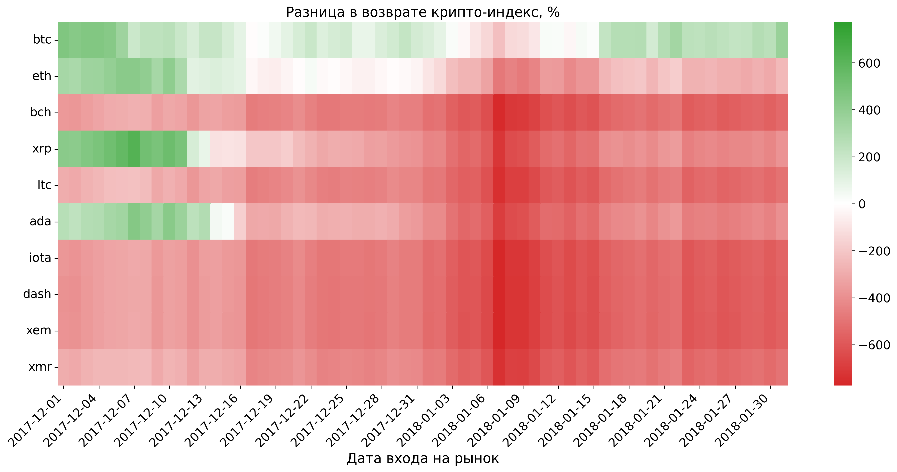

# Backtesting Indexing Strategy vs Buy-n-Hold a Single Coin

## Indexing Strategy Overview

The project backtests a market-cap weighted indexing strategy that:

- Allocates assets based on their market capitalization
- Rebalances the portfolio every 30 days
- Implements a minimum allocation threshold of 1% per asset

## Demonstrations

### 2017 bull run

Consider top performers of that time: bitcoin (btc), ethereum (eth),  ripple (xrp), bitcoin cash (bch), litecoin (ltc), Cardano (ada), iota, dash, nem (xem), monero (xmr)

```sh
python analyze.py --start-interval 2017-12-01 2018-01-31 --end-date 2024-12-31 --cryptos btc eth bch xrp ltc ada iota dash xem xmr
python visualize.py --output demo1.png
python quantify.py
```


## Data Preparation

The backtesting uses historical cryptocurrency data from CoinGecko. Here's how to prepare the data:

1. **Download Historical Data**:
   - Visit CoinGecko's historical data page for each cryptocurrency (e.g., https://www.coingecko.com/en/coins/bitcoin/historical_data)
   - Download the CSV file

2. **Required Data Format**:
   The CSV file should contain the following columns:
   - `snapped_at`: Timestamp in UTC
   - `price`: Price in USD
   - `market_cap`: Market capitalization in USD
   - `total_volume`: 24-hour trading volume in USD

3. **File Organization**:

   - Place downloaded CSV files in the `data` directory
   - Name files using the cryptocurrency's symbol
   - The project comes prepopulated with some cryptocurrencies (e.g., `bitcoin.csv`, `ethereum.csv`)

4. **Normalize Data**

Ensures consistent historical data coverage by adding zero values for cryptocurrencies during periods before they existed.

`python normalize_data.py --start-date 2013-01-01`

## Analyze returns using backtesting

### Usage

`python analyze.py [-h] [--cryptos CRYPTO [CRYPTO ...]] [--start-interval START END] [--end-date DATE] [--output FILENAME]`

### Optional arguments

- `-h, --help`  show help message and exit
- `--cryptos CRYPTO [CRYPTO ...]` list of cryptocurrencies to analyze (space-separated)
- `--start-interval START END` date range (default: 2018-01-01 to 2018-12-31)
- `--end-date DATE` single end date (default: 2024-12-31)
- `--output FILENAME` output filename (default: returns.csv)

### Examples

run with default parameters

```sh
python analyze.py
```

specify cryptocurrencies

```sh
python analyze.py --start-interval 2018-01-01 2018-01-31 --cryptos bitcoin ethereum xrp bnb sol doge cardano trx sui link
```


## Visualize analysis: plot a Heat Map

### Usage

`python visualize.py [-h] [--input FILENAME]`

### Optional arguments:

- `-h, --help`  show help message and exit
- `--input FILENAME` input CSV filename (default: returns.csv)
- `--output FILENAME`  path to save the output PNG image (show image if undefined)
- `-a, --annotate`  show numerical values in heatmap cells

### Examples

run with default arguments

`python visualize.py`

## Quantify analysis: compute different statistics

### Usage

`python quantify.py [-h] [--input FILENAME]`

### Optional Arguments

- `-h, --help`  show help message and exit
- `--input FILENAME` input CSV filename (default: returns.csv)

### Examples

run with default arguments

```sh
python quantify.py
```